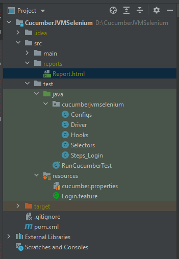

# CucumberJVMSelenium
This repo has the code which implements a Selenium Test framework using BDD (Cucumber-JVM) and Java for the website, https://www.saucedemo.com/

Project setup guide is available in the PDF doc [CucumberJVMSelenium.pdf](CucumberJVMSelenium.pdf)

### **Folder Structure**

